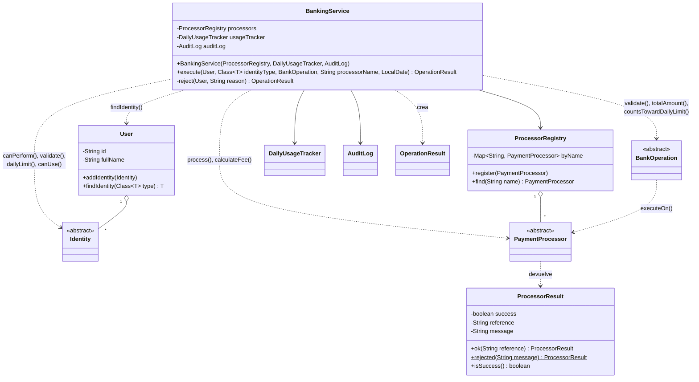
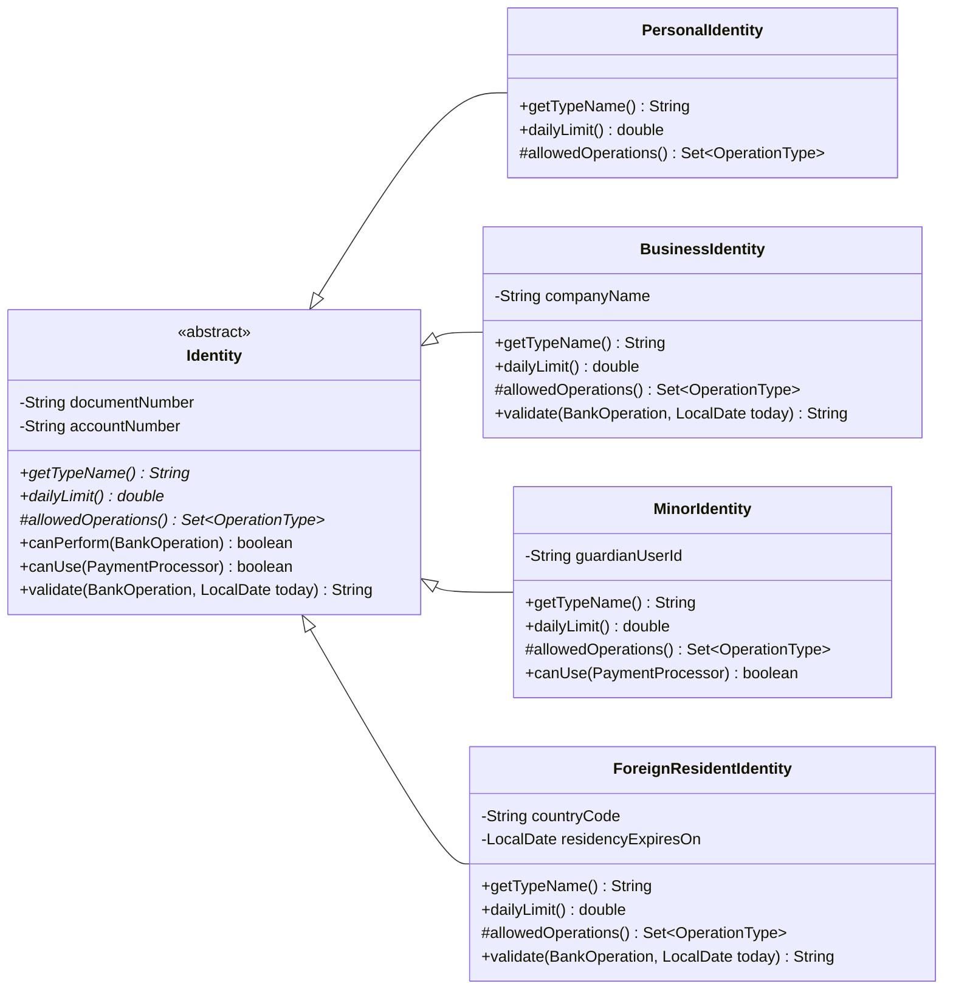
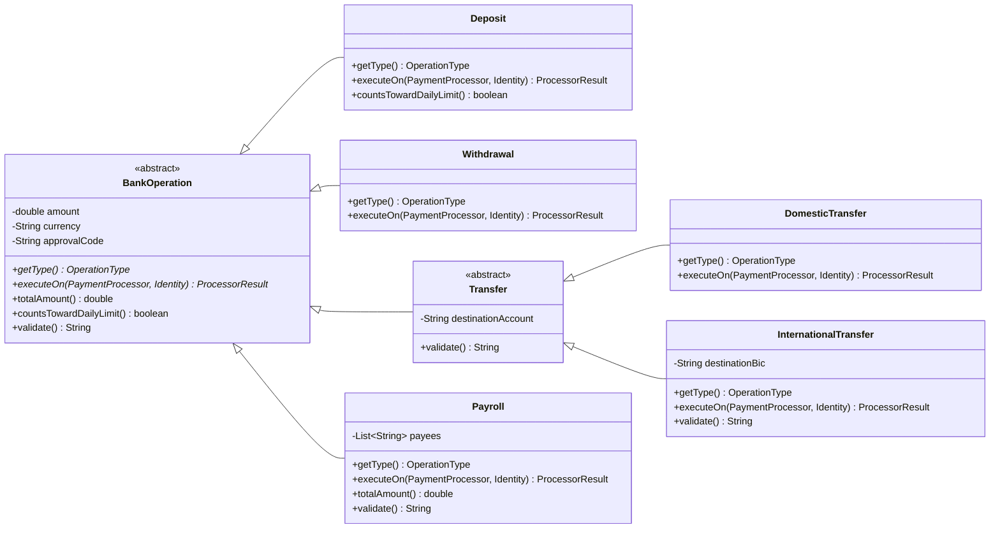
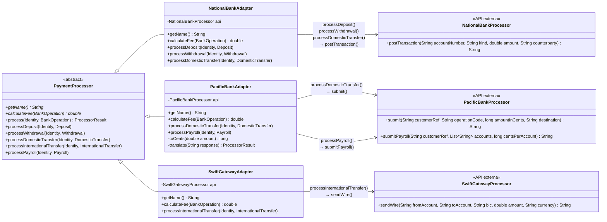
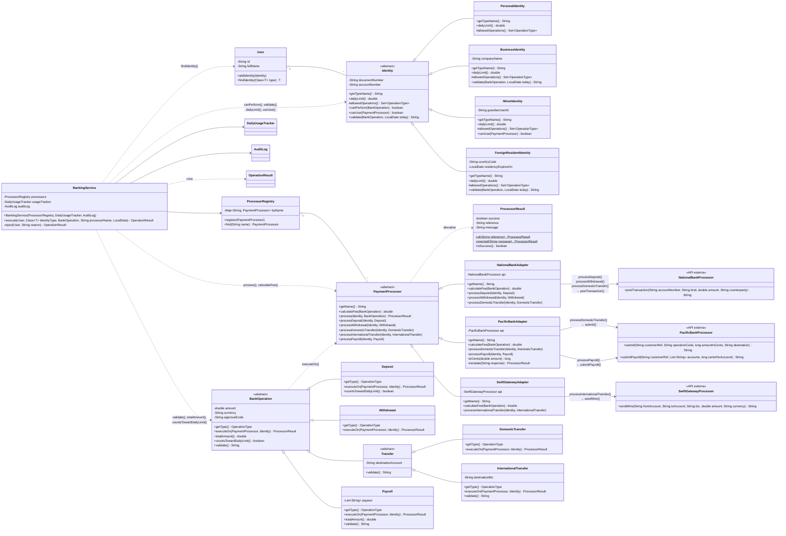

# Diseño con herencia y polimorfismo

## 1. Idea de la solución

En el diseño original, `BankingService` pregunta de qué tipo es siete veces, cuatro `switch`/`if` sobre el tipo de identidad y tres `switch` sobre el nombre del procesador. Cada pregunta es una regla que en realidad le pertenece a otro objeto.

El rediseño convierte cada una de esas preguntas en un método que el propio objeto responde:

- **`Identity`** pasa a ser una clase abstracta con cuatro subclases. Cada una conoce sus operaciones permitidas, su límite diario, sus validaciones propias y los procesadores que puede usar.
- **`BankOperation`** pasa a ser una jerarquía. Cada operación tiene solo los datos que le corresponden (una nómina tiene beneficiarios, un depósito no tiene BIC) y sabe calcular su monto total y validarse.
- **`PaymentProcessor`** es el contrato unificado de los bancos. Los tres no se tocan, cada uno queda envuelto por un *adapter* que hereda de `PaymentProcessor` y traduce nombres de métodos, unidades y estilo de fallo.
- **`BankingService`** queda como una secuencia corta de llamadas a esos colaboradores, sin ningún `switch`.

## 2. Diagrama de clases

El diseño completo tiene 26 clases, así que se presenta en cuatro vistas del mismo modelo: la colaboración general, las dos jerarquías de dominio y los procesadores con su wrapping.

`DailyUsageTracker`, `AuditLog` y `OperationResult` no cambian. El enum `IdentityType` desaparece. `OperationType` se conserva solo como etiqueta (clave de un `Set` y texto de los mensajes); nadie hace `switch` sobre él.

### 2.1 Vista general: `BankingService` y sus colaboradores

`BankingService` depende únicamente de las tres clases abstractas. Las etiquetas de las flechas indican qué métodos polimórficos llama en cada una.


### 2.2 Jerarquía de identidades

`canPerform` es un método plantilla de la clase base: consulta `allowedOperations()`, que cada subclase define. `canUse` y `validate` tienen una implementación por defecto (todo permitido, sin problemas) y solo las subclases con reglas propias las sobrescriben.



### 2.3 Jerarquía de operaciones

`totalAmount`, `countsTowardDailyLimit` y `validate` tienen implementación por defecto en la clase base. `executeOn` es el método con el que cada operación elige cuál de los métodos unificados del procesador le corresponde.



### 2.4 Procesadores: contrato unificado y wrapping de las API externas

Las tres clases externas quedan exactamente como están. `BankingService` solo conoce `PaymentProcessor.process(identity, operation)`. Ese método reparte la llamada a uno de los cinco métodos unificados `processXxx(...)`, que devuelven `ProcessorResult`. Cada adapter sobrescribe únicamente los que su API soporta y los traduce al método real; las etiquetas de las flechas muestran esa traducción.



| Método unificado (`PaymentProcessor`) | Adapter que lo sobrescribe | Llamada real a la API externa | Unidades | Fallo de la API → `ProcessorResult.rejected` |
|---|---|---|---|---|
| `processDeposit` | `NationalBankAdapter` | `postTransaction(account, "DEPOSIT", total, null)` | `double`, sin conversión | devuelve `null` |
| `processWithdrawal` | `NationalBankAdapter` | `postTransaction(account, "WITHDRAWAL", total, null)` | `double`, sin conversión | devuelve `null` |
| `processDomesticTransfer` | `NationalBankAdapter` | `postTransaction(account, "DOMESTIC_TRANSFER", total, destinationAccount)` | `double`, sin conversión | devuelve `null` |
| `processDomesticTransfer` | `PacificBankAdapter` | `submit(account, "TRF", toCents(total), destinationAccount)` | centavos (`long`) | texto con prefijo `"REJECTED:"` |
| `processPayroll` | `PacificBankAdapter` | `submitPayroll(account, payees, toCents(amount))` | centavos por beneficiario | texto con prefijo `"REJECTED:"` |
| `processInternationalTransfer` | `SwiftGatewayAdapter` | `sendWire(account, destinationAccount, destinationBic, total, currency)` | `double`, sin conversión | lanza `IllegalArgumentException` |

Cualquier combinación que no aparece en la tabla (por ejemplo, una nómina por SWIFT) cae en la implementación por defecto de `PaymentProcessor`, que devuelve `rejected("SWIFT does not support PAYROLL")`. Por eso el antiguo `processorSupports` ya no existe.

`calculateFee` sigue la misma idea: `NationalBankAdapter` devuelve 0, `PacificBankAdapter` el 0,5 % redondeado y `SwiftGatewayAdapter` 25 más 1 % si la moneda no es USD.

Aqui se puede ver la version completa del diagrama 



## 3. Dónde se aplica el polimorfismo

Estas son las líneas de `BankingService.execute(...)` que reemplazan a los siete `switch`/`if` por tipo. El servicio trabaja solo con los tipos abstractos; el objeto concreto decide qué código corre.

```java
if (!identity.canPerform(operation)) { ... }                 // antes: isOperationAllowed
String problem = identity.validate(operation, today);        // antes: checkIdentityRules (parte de identidad)
if (problem == null) problem = operation.validate();         // antes: checkIdentityRules (parte de operación)

double total = operation.totalAmount();                      // antes: totalAmount con if PAYROLL
if (operation.countsTowardDailyLimit()                       // antes: if (type != DEPOSIT)
        && used + total > identity.dailyLimit()) { ... }     // antes: dailyLimit con switch

PaymentProcessor processor = processors.find(processorName);
if (!identity.canUse(processor)) { ... }                     // antes: isProcessorAllowed

ProcessorResult result = processor.process(identity, operation);  // antes: processorSupports + dispatch + 3 estilos de fallo
double fee = processor.calculateFee(operation);                   // antes: calculateFee con switch
```

La misma línea se comporta distinto según el objeto que recibe:

| Línea | Objeto concreto | Resultado |
|---|---|---|
| `identity.dailyLimit()` | `PersonalIdentity` / `BusinessIdentity` / `MinorIdentity` / `ForeignResidentIdentity` | 2 000 / 50 000 / 100 / 5 000 |
| | `ForeignResidentIdentity` | rechaza si la residencia venció |
| | las demás | heredan la versión base, que no encuentra problemas |
| `identity.canUse(processor)` | `MinorIdentity` | solo acepta `NATIONAL` |
| `operation.totalAmount()` | `Payroll` | `amount × payees.size()`; las demás devuelven `amount` |

Así se ve la sobrescritura en las subclases:

```java
// Identity
public abstract double dailyLimit();
public boolean canUse(PaymentProcessor processor) { return true; }

// PersonalIdentity
@Override public double dailyLimit() { return 2_000; }

// MinorIdentity
@Override public double dailyLimit() { return 100; }
@Override public boolean canUse(PaymentProcessor processor) { return processor.getName().equals("NATIONAL"); }

// PaymentProcessor: contrato unificado
public final ProcessorResult process(Identity identity, BankOperation operation) {
    return operation.executeOn(this, identity);                // 1. la operación concreta responde
}

// Payroll
@Override public ProcessorResult executeOn(PaymentProcessor processor, Identity identity) {
    return processor.processPayroll(identity, this);           // 2. el procesador concreto responde
}

// PacificBankAdapter: el wrapper
@Override public ProcessorResult processPayroll(Identity identity, Payroll payroll) {
    return translate(api.submitPayroll(identity.getAccountNumber(),
            payroll.getPayees(), toCents(payroll.getAmount())));
}
```

Recorrido completo de `bank.execute(ana, BusinessIdentity.class, payroll, "PACIFIC", today)`:

`BusinessIdentity.validate` → `Payroll.totalAmount` → `BusinessIdentity.dailyLimit` → `Payroll.executeOn` → `PacificBankAdapter.processPayroll` → `PacificBankProcessor.submitPayroll`

Ninguno de esos pasos usa un `switch` ni un `instanceof`: cada llamada la resuelve el objeto que la recibe.

